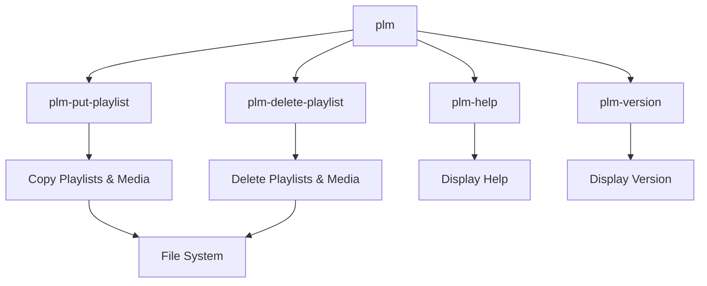
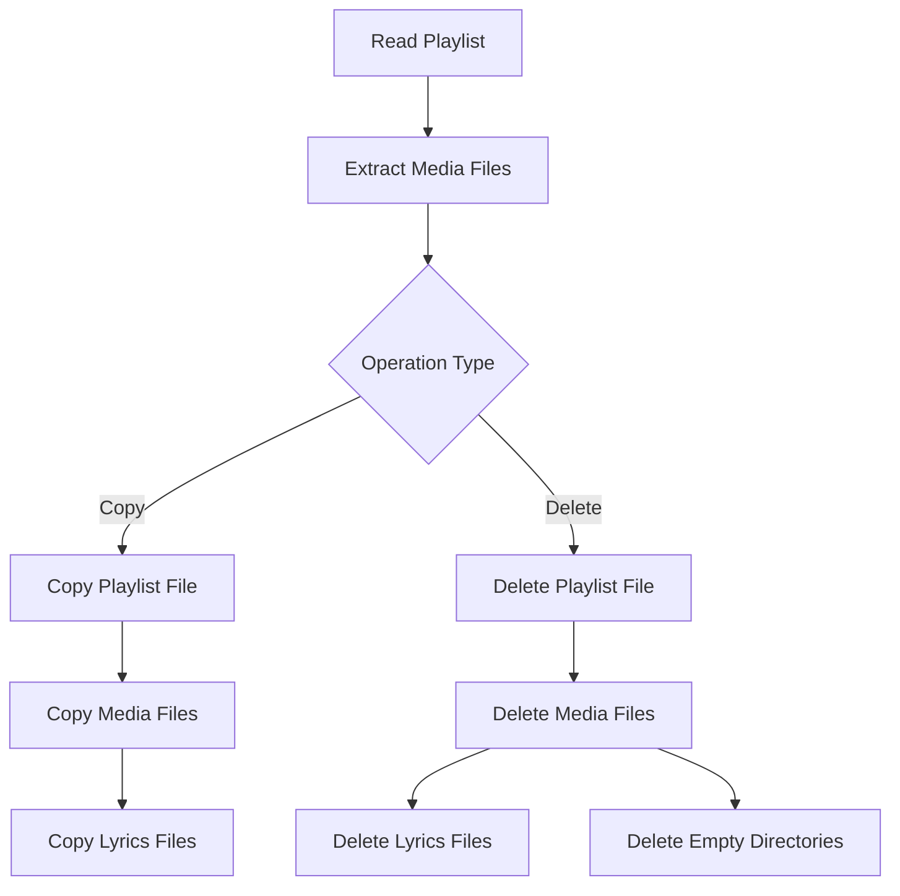

# Playlist Manager Overview

The Playlist Manager is a tool designed to manipulate playlists and
associated media files between a PC and audio playback devices.  It
provides a set of commands to manage playlists efficiently.

## Introduction

Modern audio players often support playlist files that reference media
files stored on the device.  The Playlist Manager aims to simplify the
process of transferring playlists and their associated media files
between a PC and audio playback devices.

## Architecture

The Playlist Manager follows a command-line interface (CLI) design with
a main command (`plm`) that provides access to subcommands for specific
operations.  Each subcommand is implemented as a separate executable
for modularity and maintainability.

### Components

1. **Main Command (`plm`)**
   - Entry point for all operations
   - Dispatches to appropriate subcommands
   - Provides common options and help functionality

2. **Put Playlist Command (`plm-put-playlist`)**
   - Copies playlist files from PC to device
   - Copies associated media files
   - Optionally copies lyrics files
   - Optimises to avoid copying duplicate files

3. **Delete Playlist Command (`plm-delete-playlist`)**
   - Deletes playlist files from device
   - Optionally deletes associated media files
   - Cleans up empty directories

4. **Version Command (`plm version`)**
   - Displays version information for the Playlist Manager
   - Accepts `-H/--help` flags to display help information
   - Implemented directly in the main `plm` script

## Common Components

Several components are shared across the different tools:

### Playlist Processing

All tools need to process playlist files to extract the list of media
files referenced in them.  This involves:

1. Reading the playlist file line by line
2. Filtering out comments and empty lines
3. Normalising file paths (replacing backslashes with forward slashes)
4. Extracting the base directory and relative paths

### File System Operations

Common file system operations include:

1. Copying files while preserving directory structure
2. Deleting files and directories
3. Checking file existence
4. Creating directories as needed

### Error Handling

The tools use Rust's error handling mechanisms:

1. Custom error types using `thiserror`
2. Result types for propagating errors
3. Context-rich error messages using `anyhow`

## Data Flow

## Future Enhancements

The Playlist Manager has several planned enhancements:

1. Copy albums from a PC to a device
2. Delete albums on a device
3. Create a playlist file with associated media files on a PC
4. Direct access to MTP device

## References

- [plm](plm.md) - Main command documentation
- [plm-put-playlist](plm-put-playlist.md) - Put playlist command
  documentation
- [plm-delete-playlist](plm-delete-playlist.md) - Delete playlist
  command documentation
- [directory-structure](directory-structure.md) - Project directory
  structure documentation
