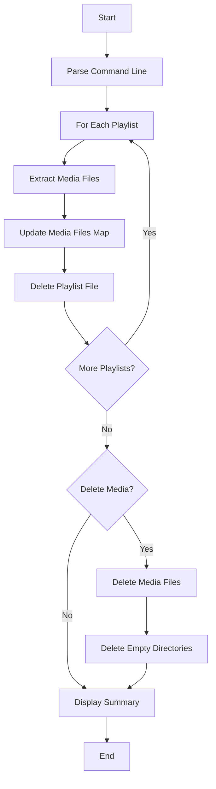
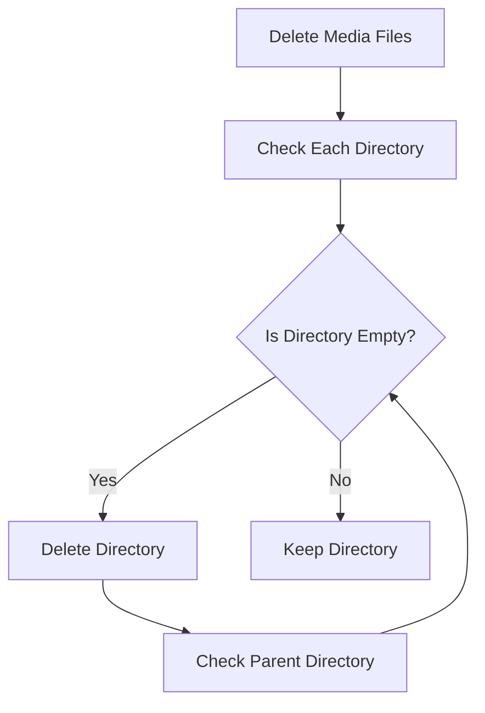

# plm-delete-playlist - Delete Playlists and Media Files

## Overview

The `plm-delete-playlist` command deletes playlist files and optionally
their associated media files from a device.  It can remove just the
playlist files or also delete the media files referenced within them,
cleaning up empty directories in the process.

## Command Structure

```
plm delete-playlist [OPTIONS] PLAYLIST [...]
```

or directly:

```
plm-delete-playlist [OPTIONS] PLAYLIST [...]
```

## Options

- `-v, --verbose`: Print verbose messages about the deletion process
- `-m, --media`: Delete media files (and lyrics files with `.lrc`
  extension) associated with the playlist
- `-H, --help`: Display help information and exit
- `-V, --version`: Display version information and exit

## Parameters

- `PLAYLIST [...]`: One or more playlist files to delete

## Workflow



## Implementation Details

### Playlist Processing

The command processes each playlist file to:

1. Extract the list of media files referenced in the playlist
2. Maintain a map of media files to avoid processing duplicates
3. Delete the playlist file

### Media Files Deletion

When the `-m, --media` option is specified, the command also:

1. Deletes all media files referenced in the playlists
2. Deletes corresponding lyrics files (with `.lrc` extension)
3. Recursively deletes empty directories after removing files

### Directory Cleanup

After deleting media files, the command recursively deletes empty
directories up to the directory where the playlist resides.  This helps
keep the device storage clean and organised.



### Error Handling

The command handles various error conditions:

- Missing playlist files
- Failed file operations (read, delete)
- Failed directory operations (read, delete)

## Examples

### Basic Usage

Delete a single playlist file:

```bash
plm delete-playlist /mnt/sdcard/MUSIC/playlist.m3u8
```

### Delete Multiple Playlists

Delete multiple playlist files:

```bash
plm delete-playlist /mnt/sdcard/MUSIC/playlist1.m3u8 /mnt/sdcard/MUSIC/playlist2.m3u8
```

### Delete with Media Files

Delete a playlist and its associated media files:

```bash
plm delete-playlist --media /mnt/sdcard/MUSIC/playlist.m3u8
```

### Verbose Output

Delete with verbose output:

```bash
plm delete-playlist --verbose --media /mnt/sdcard/MUSIC/playlist.m3u8
```

## Exit Status

- `0`: Command successfully exits
- `255`: Command fails with invalid command line arguments
- `1`: Command fails with other errors

## Code Structure

The implementation is organised into several key functions:

1. `main()`: Entry point that parses command-line arguments and
   orchestrates the process
2. `extract_media_files()`: Extracts media files from a playlist
3. `delete_playlist_file()`: Deletes a playlist file
4. `delete_media_files()`: Deletes media files and lyrics files
5. `delete_empty_dirs()`: Recursively deletes empty directories
6. `print_message()`: Prints a message if verbose mode is enabled

## Optimisation

The command optimises the deletion process by:

1. Processing all playlists first to collect a complete list of media
   files
2. Using a HashSet to avoid processing duplicate files
3. Deleting files only once, even if they are referenced in multiple
   playlists

## Safety Considerations

The command includes several safety features:

1. It only deletes media files that are explicitly referenced in the
   playlists
2. It only deletes empty directories, preserving directories that
   contain other files
3. It provides verbose output to show exactly what is being deleted

## See Also

- [Overview](overview.md) - Playlist Manager overview
- [plm](plm.md) - Main command documentation
- [plm-put-playlist](plm-put-playlist.md) - Put playlist command
  documentation
