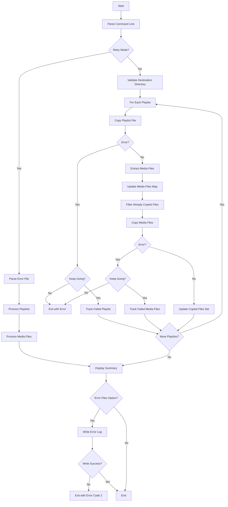
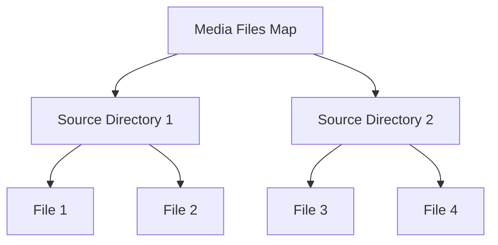

# plm-put-playlist - Copy Playlists and Media Files

## Overview

The `plm-put-playlist` command copies playlist files and their
associated media files from a PC to a device.  It handles the transfer
of both the playlist files and the media files referenced within them,
maintaining the directory structure and optimising to avoid copying
duplicate files.

## Command Structure

For normal operation:

```
plm put-playlist [OPTIONS] DEST PLAYLIST [...]
```

For retry operation:

```
plm put-playlist -r FILE [-v] [-l] [-e FILE] [-k] DEST
```

or directly:

```
plm-put-playlist [OPTIONS] DEST PLAYLIST [...]
```

```
plm-put-playlist -r FILE [-v] [-l] [-e FILE] [-k] DEST
```

## Options

- `-v, --verbose`: Print verbose messages about the copying process
- `-l, --lyrics`: Copy lyrics files (with `.lrc` extension) along with
  media files
- `-k, --keep-going`: Continue operation despite errors
- `-e, --error-files FILE`: Write list of failed files to specified
  file (must be used with `--keep-going` unless used with `--retry`)
- `-r, --retry FILE`: Retry failed operations from error file
- `-H, --help`: Display help information and exit
- `-V, --version`: Display version information and exit

## Parameters

- `DEST`: Destination directory to put playlists and media files into
- `PLAYLIST [...]`: One or more playlist files to process

## Workflow



## Implementation Details

### Playlist Processing

The command processes each playlist file to:

1. Copy the playlist file to the destination
2. Extract the list of media files referenced in the playlist
3. Maintain a map of media files to avoid copying duplicates
4. Copy each media file while preserving the directory structure

### Path Normalisation

During the copying process, backslash characters (`\`) in playlist
files are replaced with forward slash characters (`/`) to ensure
compatibility across different systems.

### Media Files Map

The command maintains a map of media files to avoid copying the same
file multiple times when it's referenced in multiple playlists.  This
optimisation is particularly useful for large collections where the
same media files might be referenced in multiple playlists.



### Lyrics Files

When the `-l, --lyrics` option is specified, the command also copies
lyrics files (with `.lrc` extension) that correspond to the media files.
It looks for lyrics files with the same base name as the media files
but with the `.lrc` extension.

### Error Handling

The command handles various error conditions:

- Invalid destination directory
- Missing playlist files
- Failed file operations (read, write, copy)

When the `-k, --keep-going` option is specified, the command will
continue operation despite errors.  It will attempt to process all
playlists and copy all media files, skipping only those that encounter
errors.  At the end, it will display a summary of the number of
successfully copied playlists and media files in the form of "(a/b)
playlist copied" and "(c/d) media files copied", where:

- `a` is the number of successfully copied playlists
- `b` is the total number of playlists to be copied
- `c` is the number of successfully copied media files (excluding lyrics
  files)
- `d` is the total number of media files to be copied (excluding lyrics
  files)

When the `-e, --error-files` option is specified along with
`-k, --keep-going`, the command will write the list of playlist files
and media files that failed to copy to the specified file.  If no errors
occur during the operation, the error file will be created but remain
empty.  Each line in the error file is prefixed with either "P " for
failed playlists or "M " for failed media files, and the entries are
listed in the order they failed.  If the file cannot be created, the
command will print an error message to stderr and exit with status code
2.

If the `-e, --error-files` option is used without the `-k, --keep-going`
option and not with the `-r, --retry` option, the command will print an
error message to stderr and exit with status code 255.

### Retry Functionality

When the `-r, --retry` option is specified, the command will read the
error file produced by a previous run with the `-e, --error-files`
option and retry the failed operations. The command syntax in this case
is:

```
plm-put-playlist -r FILE [-v] [-l] [-e FILE] [-k] DEST
```

The operation is done as follows:

1. Read one line from the error file.
2. If the line is prefixed by "M", it is a media file to copy.  Copy
   the media file and read the next line.  This is repeated until the
   file reaches the end or the next line is prefixed by "P".
3. If the line is prefixed by "P", it is a playlist to copy.  Copy the
   playlist file.  Then read the next line (say, line B) and if the
   next line is prefixed by "M", copy the media file and repeat until
   the file reaches the end or the line prefixed by "P".  If the line B
   is prefixed by "P" (that is, two consecutive lines are prefixed by
   "P"), copy media files in the first playlist.
4. When all files are copied, print the summary (the number of playlist
   files and the number of media files as the standard operation) to
   stdout.

The `-e, --error-files` option can be given with the `-r, --retry`
option at the same time.  A new error file is created for the operation
of the `-r, --retry` option.  If the same file is specified by `-r` and
`-e`, the command will print an error message to stderr and exit with
status code 255.

## Examples

### Basic Usage

Copy a single playlist and its media files:

```
plm put-playlist /mnt/sdcard/MUSIC ~/MUSIC/playlist.m3u8
```

### Copy Multiple Playlists

Copy multiple playlists and their media files:

```
plm put-playlist /mnt/sdcard/MUSIC ~/MUSIC/playlist1.m3u8 ~/MUSIC/playlist2.m3u8
```

### Copy with Lyrics

Copy a playlist, its media files, and corresponding lyrics files:

```
plm put-playlist --lyrics /mnt/sdcard/MUSIC ~/MUSIC/playlist.m3u8
```

### Verbose Output

Copy with verbose output:

```
plm put-playlist --verbose /mnt/sdcard/MUSIC ~/MUSIC/playlist.m3u8
```

When the `-v` option is given, the command will display messages about
the copying process:

- For playlist files: `({}/{}) Copy playlist {} to {}`
- For media files: `({}-M/{}) Copy track {} to {}`
- For lyrics files: `({}-L/{}) Copy lyrics {} to {}`

Where:

- The first number is the current file being processed
- The second number is the total number of files to be processed
- The `-M` suffix indicates a media file
- The `-L` suffix indicates a lyrics file

The n-th file to copy is the n-th file of all files to copy across all
playlist files, and only successfully copied files are counted in the
sequence.  For example, if playlist A has 10 media files and playlist B
has 15 media files, with 5 media files shared between them, the total
number of media files to be copied is 20 (10+15-5).  The file counter
will progress from 1 to 20 across both playlists, skipping any files
that fail to copy.

### Continue Despite Errors

Copy playlists and media files, continuing despite errors:

```
plm put-playlist --keep-going /mnt/sdcard/MUSIC ~/MUSIC/playlist1.m3u8 ~/MUSIC/playlist2.m3u8
```

### Log Failed Files

Copy playlists and media files, continuing despite errors and logging
failed files:

```
plm put-playlist --keep-going --error-files errors.log /mnt/sdcard/MUSIC ~/MUSIC/playlist1.m3u8 ~/MUSIC/playlist2.m3u8
```

### Retry Failed Operations

Retry failed operations from an error file:

```
plm put-playlist --retry errors.log /mnt/sdcard/MUSIC
```

### Retry with Lyrics

Retry failed operations and copy lyrics files along with media files:

```
plm put-playlist --retry errors.log --lyrics /mnt/sdcard/MUSIC
```

### Retry with New Error Log

Retry failed operations and create a new error log for operations that
still fail:

```
plm put-playlist --retry errors.log --keep-going --error-files new-errors.log /mnt/sdcard/MUSIC
```

## Exit Status

- `0`: Command successfully exits
- `1`: Command fails during execution (e.g., file copy errors) when
  `--keep-going` is not specified
- `2`: Command fails to create the error log file specified with
  `--error-files`
- `255`: Command fails with invalid command line arguments

## Code Structure

The implementation is organised into several key components:

### Modules

1. `plm_put_playlist_retry`: A module that contains functions related to
   retry functionality, including parsing error files and retrying
   failed operations.

### Data Structures

1. `CommandOptions`: A struct that holds command line options (verbose,
   copy_lyrics, keep_going)
2. `ErrorTracker`: A struct to track failed files during operation
3. `FailureType`: An enum to represent different types of failures
   (playlist or media file)
4. `MediaFileInfo`: A shared struct that holds information about a media
   file (src_basedir and file), used by both the main module and the
   retry module to reduce the number of arguments in functions that
   handle media files
5. `RetryContext`: A struct in the retry module that holds destination
   directory information, used to reduce the number of arguments in the
   retry functions
6. `MediaContext`: A struct in the retry module that holds media files
   map and copied files information, used to reduce the number of
   arguments in the retry functions
7. `ProgressContext`: A struct in the retry module that holds progress
   tracking information (current playlist number, total playlists, total
   media files, successful media files), used to reduce the number of
   arguments in the retry functions

### Key Functions

#### Main Module

1. `main()`: Entry point that orchestrates the entire operation by
   calling helper functions in sequence
2. `handle_arguments()`: Parses and validates command-line arguments
3. `prepare_environment()`: Sets up the operating environment including
   destination directory validation and error tracker initialization
4. `run_core_logic()`: Executes the main operations (retry or normal
   mode) and prints summary results
5. `perform_cleanup()`: Handles cleanup operations such as writing error
   log files
6. `process_playlist()`: Processes a playlist file and extracts media
   files
7. `copy_playlist_file()`: Copies a playlist file to the destination
8. `extract_media_files()`: Extracts media files from a playlist
9. `copy_media_files()`: Copies media files from source to destination
10. `copy_single_media_file()`: Copies a single media file and its
    lyrics if requested
11. `filter_already_copied_files()`: Filters out files that have already
    been copied
12. `process_normal_operations()`: Processes normal operations (non-
    retry mode)
13. `abs_dir()`: Gets the absolute path of a directory
14. `print_message()`: Prints a message if verbose mode is enabled

#### Retry Module

1. `parse_error_file()`: Parses an error file and extracts failed
   playlists and media files
2. `retry_operations()`: Retries failed operations from an error file
3. `retry_playlist()`: Retries processing a single playlist from the
   error file
4. `retry_media_file()`: Retries copying a single media file from the
   error file

#### Playlist Scanner Module

The command uses a dedicated `playlist_scanner` module for processing
playlist files. This module:

1. Provides a streaming iterator interface for efficient memory usage
2. Handles common playlist file formatting issues:
   - Removes Byte Order Mark (BOM) if present
   - Removes carriage returns
   - Filters out comments and empty lines
   - Normalizes path separators (backslashes to forward slashes)
3. Is shared with other commands to ensure consistent playlist parsing

### Architecture Improvements

The `main()` function has been refactored to improve maintainability:

1. **Separation of Concerns**: Each helper function has a single,
   well-defined responsibility
2. **Centralized Exit Logic**: All `process::exit` calls are handled in
   `main()` based on the results of helper functions
3. **Better Error Handling**: Each function returns `Result` types with
   appropriate error context
4. **Improved Testability**: Smaller functions are easier to unit test
   individually
5. **Clear Program Flow**: The main function now clearly shows the
   sequence of operations: argument handling, environment preparation,
   core logic execution, and cleanup

## Optimisation

The command optimises the copying process by:

1. Processing each playlist one-by-one
2. Maintaining a map of media files across all playlists
3. Tracking already copied files to avoid duplicates
4. Copying only the files that haven't been copied yet

## See Also

- [Overview](overview.md) - Playlist Manager overview
- [plm](plm.md) - Main command documentation
- [plm-delete-playlist](plm-delete-playlist.md) - Delete playlist
  command documentation
