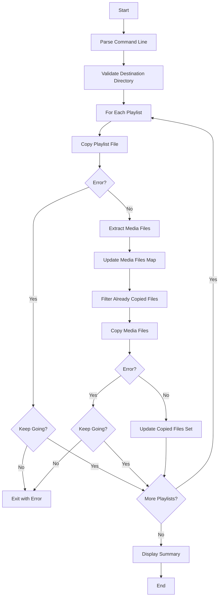
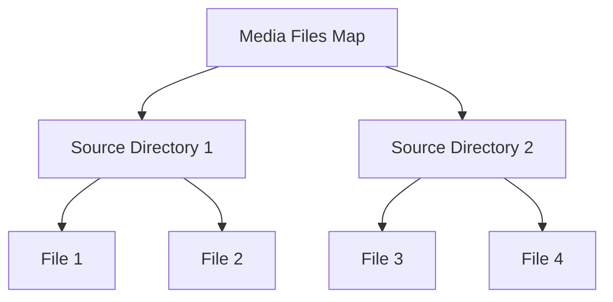

# plm-put-playlist - Copy Playlists and Media Files

## Overview

The `plm-put-playlist` command copies playlist files and their
associated media files from a PC to a device.  It handles the transfer of
both the playlist files and the media files referenced within them,
maintaining the directory structure and optimising to avoid copying
duplicate files.

## Command Structure

```
plm put-playlist [OPTIONS] DEST PLAYLIST [...]
```

or directly:

```
plm-put-playlist [OPTIONS] DEST PLAYLIST [...]
```

## Options

- `-v, --verbose`: Print verbose messages about the copying process
- `-l, --lyrics`: Copy lyrics files (with `.lrc` extension) along with
  media files
- `-k, --keep-going`: Continue operation despite errors
- `-H, --help`: Display help information and exit
- `-V, --version`: Display version information and exit

## Parameters

- `DEST`: Destination directory to put playlists and media files into
- `PLAYLIST [...]`: One or more playlist files to process

## Workflow



## Implementation Details

### Playlist Processing

The command processes each playlist file to:

1. Copy the playlist file to the destination
2. Extract the list of media files referenced in the playlist
3. Maintain a map of media files to avoid copying duplicates
4. Copy each media file while preserving the directory structure

### Path Normalisation

During the copying process, backslash characters (`\`) in playlist files
are replaced with forward slash characters (`/`) to ensure compatibility
across different systems.

### Media Files Map

The command maintains a map of media files to avoid copying the same
file multiple times when it's referenced in multiple playlists.  This
optimisation is particularly useful for large collections where the same
media files might be referenced in multiple playlists.



### Lyrics Files

When the `-l, --lyrics` option is specified, the command also copies
lyrics files (with `.lrc` extension) that correspond to the media files.  
It looks for lyrics files with the same base name as the media files but
with the `.lrc` extension.

### Error Handling

The command handles various error conditions:

- Invalid destination directory
- Missing playlist files
- Failed file operations (read, write, copy)

When the `-k, --keep-going` option is specified, the command will
continue operation despite errors.  It will attempt to process all
playlists and copy all media files, skipping only those that encounter
errors.  At the end, it will display a summary of the number of
successfully copied playlists and media files in the form of "(a/b)
playlist copied" and "(c/d) media files copied", where:

- `a` is the number of successfully copied playlists
- `b` is the total number of playlists to be copied
- `c` is the number of successfully copied media files (excluding lyrics
  files)
- `d` is the total number of media files to be copied (excluding lyrics
  files)

## Examples

### Basic Usage

Copy a single playlist and its media files:

```bash
plm put-playlist /mnt/sdcard/MUSIC ~/MUSIC/playlist.m3u8
```

### Copy Multiple Playlists

Copy multiple playlists and their media files:

```bash
plm put-playlist /mnt/sdcard/MUSIC ~/MUSIC/playlist1.m3u8 ~/MUSIC/playlist2.m3u8
```

### Copy with Lyrics

Copy a playlist, its media files, and corresponding lyrics files:

```bash
plm put-playlist --lyrics /mnt/sdcard/MUSIC ~/MUSIC/playlist.m3u8
```

### Verbose Output

Copy with verbose output:

```bash
plm put-playlist --verbose /mnt/sdcard/MUSIC ~/MUSIC/playlist.m3u8
```

### Continue Despite Errors

Copy playlists and media files, continuing despite errors:

```bash
plm put-playlist --keep-going /mnt/sdcard/MUSIC ~/MUSIC/playlist1.m3u8 ~/MUSIC/playlist2.m3u8
```

## Exit Status

- `0`: Command successfully exits
- `255`: Command fails with invalid command line arguments
- `1`: Command fails with other errors

## Code Structure

The implementation is organised into several key functions:

1. `main()`: Entry point that parses command-line arguments and
   orchestrates the process
2. `process_playlist()`: Processes a playlist file and extracts media
   files
3. `copy_playlist_file()`: Copies a playlist file to the destination
4. `extract_media_files()`: Extracts media files from a playlist
5. `copy_media_files()`: Copies media files from source to destination
6. `filter_already_copied_files()`: Filters out files that have already
   been copied
7. `abs_dir()`: Gets the absolute path of a directory
8. `print_message()`: Prints a message if verbose mode is enabled

## Optimisation

The command optimises the copying process by:

1. Processing each playlist one-by-one
2. Maintaining a map of media files across all playlists
3. Tracking already copied files to avoid duplicates
4. Copying only the files that haven't been copied yet

## See Also

- [Overview](overview.md) - Playlist Manager overview
- [plm](plm.md) - Main command documentation
- [plm-delete-playlist](plm-delete-playlist.md) - Delete playlist command
  documentation
