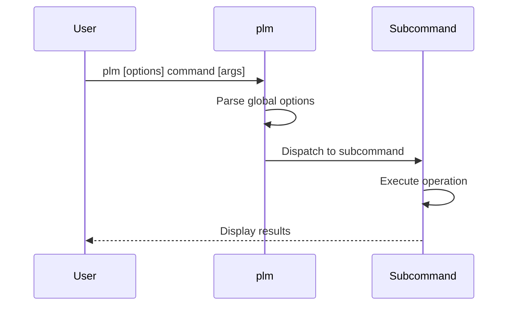

# plm - Playlist Manager Main Command

## Overview

The `plm` command is the main entry point for the Playlist Manager tool.  
It provides a unified interface to access various subcommands for
manipulating playlists and associated media files between a PC and audio
playback devices.

## Command Structure

```
plm [OPTIONS] COMMAND [COMMAND_OPTIONS] COMMAND_PARAMETERS
```

## Options

- `-v, --verbose`: Print verbose messages
- `-H, --help`: Display help information and exit
- `-V, --version`: Display version information and exit

## Subcommands

### put-playlist

Copies playlist files and associated media files from a PC to a device.

```
plm put-playlist [OPTIONS] DEST PLAYLIST [...]
```

See [plm-put-playlist](plm-put-playlist.md) for detailed documentation.

### delete-playlist

Deletes playlist files and optionally associated media files from a
device.

```
plm delete-playlist [OPTIONS] PLAYLIST [...]
```

See [plm-delete-playlist](plm-delete-playlist.md) for detailed
documentation.

### help

Displays help information for a specific command or for the `plm`
command itself.

```
plm help [COMMAND]
```

### version

Displays version information for the `plm` command and exits.

```
plm version
```

## Workflow



## Exit Status

- `0`: Command successfully exits
- `255`: Command fails with invalid command line arguments

## Examples

### Copy a playlist and its media files

```
plm put-playlist /mnt/sdcard/MUSIC ~/MUSIC/playlist.m3u8
```

### Copy a playlist with verbose output

```
plm -v put-playlist /mnt/sdcard/MUSIC ~/MUSIC/playlist.m3u8
```

### Delete a playlist and its media files

```
plm delete-playlist --media /mnt/sdcard/MUSIC/playlist.m3u8
```

### Get help for a specific command

```
plm help put-playlist
```

### Display version information

```
plm version
```

## Implementation Details

The `plm` command is implemented as a shell script that:

1. Parses global options
2. Identifies the requested subcommand
3. Passes appropriate options and parameters to the subcommand
   executable
4. Returns the exit status from the subcommand

The actual functionality is implemented in separate executables for
each subcommand, which are located in the `libexec/playlist-manager`
directory.

## See Also

- [Overview](overview.md) - Playlist Manager overview
- [plm-put-playlist](plm-put-playlist.md) - Put playlist command
  documentation
- [plm-delete-playlist](plm-delete-playlist.md) - Delete playlist
  command documentation
